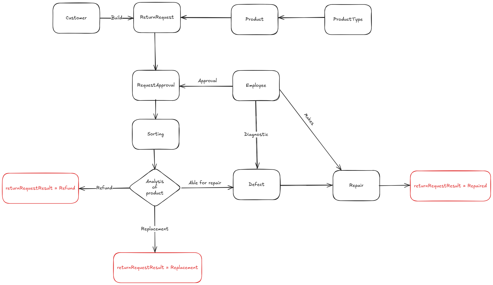

# Título

## Return Material Authorization

Protótipo do Sistema de RMA

## Descrição

Este é um protótipo de um sistema de RMA (Return Merchandise Authorization), para um **Dashboard Interativo com a visão geral
das solicitações de RMA em andamento.

- Status da Solicitação de Retorno:
    - Aguardando Análise: Solicitações aguardando análise ou aprovação.
    - Em Reparo: Solicitações que estão em processo de reparo.
    - Pronto para Devolução: Solicitações que estão prontas para devolução.

- Resultado da Solicitação de Devolução:
    - Reembolso: Solicitações que resultaram em reembolso.
    - Em Andamento (WIP): Solicitações em andamento.
    - Substituição: Solicitações que resultaram em substituição.
    - Cancelado: Solicitações que foram canceladas.
    - Reparado: Solicitações que resultaram em reparo.

- Defeitos:
    - O sistema exibe os defeitos mais frequentemente reportados nas solicitações de RMA, com dois status:
      - WIP (Em Andamento): Defeito em processo de reparo.
      - Done (Concluído): Defeito resolvido ou reparado.

- Defeitos Mais Comuns: O sistema identifica e exibe os defeitos mais frequentemente reportados nas solicitações de RMA, ajudando os supervisores a identificar padrões e melhorar os processos.

- Tempo Médio por Etapa: O painel também calcula o tempo médio que uma solicitação leva em cada etapa, proporcionando uma percepções sobre a eficiência do processo.

## Tecnologias Utilizadas

- FastAPI: Framework Python para construir APIs.
- PostgreSQL: Banco de dados relacional utilizado para armazenar as informações de RMA.
- Docker: Utilizado para containerizar a aplicação e o banco de dados, facilitando o ambiente de desenvolvimento e implantação.
- AWS: Serviço do AWS Secrect Manager

---
## Diagrama de Banco de Dados

---
---
## Fluxo Proposto para o RMA (Backend)

---
## Instalação

Para rodar o protótipo localmente, siga os passos abaixo.

### Pré-requisitos

- Docker
- Python 3.12+

### Passos para instalação

1. Clone o repositório:

git clone https://github.com/RafaelFCouto/ReturnMateialAuthorization.git

2. Acesse o diretório do projeto:

    cd ReturnMateialAuthorization

3. Execute o seguinte comando para rodar o banco de dados PostgreSQL em um container:

    docker run -d --name rma-db -e POSTGRES_USER=RMAUser -e POSTGRES_PASSWORD='fT4109IRF#d!' -e POSTGRES_DB=RMADatabase -p 5432:5432 postgres:latest

4. Instale as dependências da aplicação FastAPI:

    pip install -r requirements.txt

5. Inicie a aplicação FastAPI:

    python3 run.py

6. O sistema estará disponível em [http://localhost:8000]

---
## Impedimentos

- A ideação de um sistema muito robusto pra tratar o problema solicitado. Com isso, demorou muito para definição dos modelos e implementação no backend;
- Falta de tempo hábil para implementar o front end do dashboard;
- Adequação da agenda com o período de vigência do teste;

---

## Licença

Este projeto está licenciado sob a Licença MIT. Veja o arquivo [LICENSE](LICENSE) para mais detalhes.

---

## Autor

- *Rafel Freire Couto da Silva*

---
Estou a diposição para sanar possíveis dúvidas, entre em contato pelo [WhatsApp](https://wa.me/5592991004063)